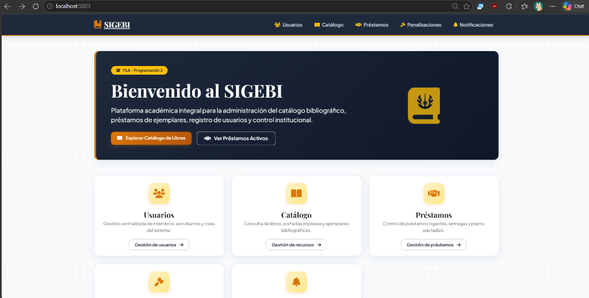
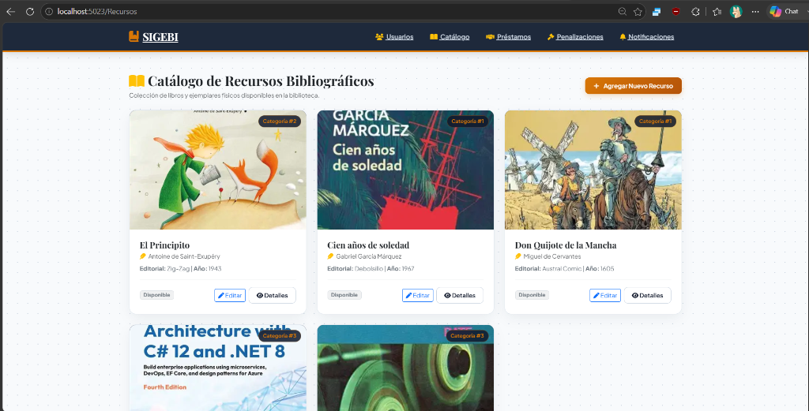

# 📚 SIGEBI - Sistema de Gestión de Bibliotecas Institucional

**Instituto Tecnológico de Las Américas (ITLA)**  
**Asignatura:** Programación 2  
**Profesor:** Francis Ramírez  
**Estudiante:** Franklyn Enmanuel Santana Rodríguez  
**Matrícula:** 2025-2089  
**Carrera:** Desarrollo de Software  
**Enlace del Repositorio:** [https://github.com/Osiris3939/SIGEBI](https://github.com/Osiris3939/SIGEBI)  

---

## 📸 Demostración Visual del Sistema (`http://localhost:5023`)

### 1. Página de Inicio y Dashboard General


### 2. Catálogo de Recursos Bibliográficos con Portadas Reales


---

## 🌟 COMPONENTES EVALUADOS Y PUNTOS EXTRAS (PUNTAJE MÁXIMO)

En esta entrega se abordaron y completaron los requerimientos de arquitectura en multicapas y los componentes avanzados especificados para la evaluación de puntos extras:

### 1. ⭐ Abstracción y Polimorfismo del Logger (`ILoggerService`) — *Puntos Extras*
* **Abstracción (Capa de Dominio):** Se define la interfaz contrato `ILoggerService.cs` (`LogInformation`, `LogWarning`, `LogError`).
* **Implementaciones Polimórficas (Capa de Infraestructura):**
  * `ConsoleLoggerService.cs`: Formatea e imprime los logs de auditoría en la Consola del sistema.
  * `FileLoggerService.cs`: Registra y persiste físicamente las trazas de auditoría en archivos de texto `.txt`.
  * `CompositeLoggerService.cs`: Implementa el **Patrón de Diseño Composite**, transmitiendo de manera transparente cada evento a la Consola y al Archivo al mismo tiempo.
* **Inyección de Dependencias:** Inyectado dinámicamente en la capa IoC (`SIGEBI.IOC`) y consumido en la totalidad de los Servicios de Aplicación y Controladores.

### 2. ⭐ Abstracción y Polimorfismo del Envío de Correos (`INotificationSenderService`) — *Puntos Extras*
* **Abstracción (Capa de Dominio):** Se define la interfaz contrato `INotificationSenderService.cs` (`SendNotificationAsync`).
* **Implementaciones Polimórficas (Capa de Infraestructura):**
  * `EmailNotificationSenderService.cs`: Simula el envío estructurado de notificaciones por correo electrónico institucional.
  * `SmsNotificationSenderService.cs`: Gestiona el envío de notificaciones vía mensajería SMS.
  * `CompositeNotificationSenderService.cs`: Aplica el **Patrón Composite** reuniendo múltiples canales de salida e inyectándose directamente en `NotificacionService.cs`.

### 3. ⭐ Patrón Estructurado de Manejo de Errores (`OperationResult` + `try-catch`) — *Puntos Extras*
* **Objeto de Resultado Operacional (`OperationResult.cs`):** Encapsula el resultado de cada transacción de negocio (`Success`, `Message`, `Error`).
* **Control de Excepciones:** Todos los métodos de la capa de aplicación (`UsuarioService`, `RecursoBibliograficoService`, `PrestamoService`, `PenalizacionService`, `NotificacionService`, `ReporteService`) están protegidos por bloques `try-catch`.
* **Auditoría:** En caso de excepción, el fallo se registra mediante el `ILoggerService` polimórfico y se retorna un resultado controlado a la presentación, garantizando que el servidor nunca colapse.

### 4. ⭐ Repositorios Funcionales y Base de Datos Semilla (`SIGEBIDbSeeder`) — *Evaluación Principal*
* **Base de Datos Standalone:** Se integró el proveedor **EF Core InMemory Database** (`UseInMemoryDatabase("SIGEBI_DB")`) para permitir ejecución en vivo e inmediata en `localhost:5023` sin dependencias externas de SQL Server.
* **Siembra de Datos (`SIGEBIDbSeeder.cs`):** Al iniciar la aplicación, se pueblan automáticamente los **5 módulos principales** (*Usuarios, Catálogo de Recursos, Préstamos, Penalizaciones y Notificaciones*) con registros funcionales listos para operaciones CRUD (`Crear`, `Editar`, `Ver Detalles`, `Eliminar`).

### 5. ⭐ Capa de Presentación Web MVC y Estética Institucional
* **Arquitectura Clean MVC:** Controladores en `SIGEBI.Web/Controllers` y Vistas Razor en `SIGEBI.Web/Views`.
* **Diseño e Iconografía:** Estilizado con paleta de biblioteca institucional (azul noche `#1e293b`, acentos dorados `#d97706`), fuentes tipográficas `Playfair Display` y `Plus Jakarta Sans`, iconografía de FontAwesome y animaciones fluidas con la librería `AOS` (Animate On Scroll).

---

## 🏗️ Arquitectura de la Solución (Multicapa N-Tier)

```
                                  [ SIGEBI.Web (MVC) ]
                                            |
                                 [ SIGEBI.Application ]
                                 /          |          \
           [ SIGEBI.Domain ]   <--  [ SIGEBI.IOC ]  -->   [ SIGEBI.Infrastructure ]
                  ^                                              |
                  +------------- [ SIGEBI.Persistence ] ---------+
```

1. **Core / SIGEBI.Domain:** Entidades de negocio, interfaces de repositorio (`IUsuarioRepository`, `IRecursoBibliograficoRepository`, etc.), interfaces de servicios de infraestructura (`ILoggerService`, `INotificationSenderService`) y objeto `OperationResult`.
2. **Application / SIGEBI.Application:** DTOs e Interfaces de Servicio de Aplicación (`IUsuarioService`, `IRecursoBibliograficoService`, `IPrestamoService`, `IPenalizacionService`, `INotificacionService`).
3. **Infrastructure / SIGEBI.Infrastructure:** Implementaciones polimórficas para logging (`ConsoleLoggerService`, `FileLoggerService`, `CompositeLoggerService`) y notificaciones (`EmailNotificationSenderService`, `SmsNotificationSenderService`, `CompositeNotificationSenderService`).
4. **Infrastructure / SIGEBI.Persistence:** Contexto EF Core (`SIGEBIContext`), repositorios concretos y seeder de datos de prueba (`SIGEBIDbSeeder`).
5. **IOC / SIGEBI.IOC:** Contenedor central de inyección de dependencias (`DependencyContainer.cs`).
6. **Web / SIGEBI.Web:** Capa de presentación ASP.NET Core MVC.

---

## 🛠️ Instrucciones para Compilar y Ejecutar

1. **Clonar el repositorio:**
   ```bash
   git clone https://github.com/Osiris3939/SIGEBI.git
   cd SIGEBI
   ```

2. **Compilar la solución completa:**
   ```bash
   dotnet build
   ```

3. **Ejecutar la aplicación Web:**
   ```bash
   dotnet run --project Web/SIGEBI.Web/SIGEBI.Web.csproj --launch-profile http
   ```

4. **Navegar en el explorador:**
   Ingrese a **`http://localhost:5023`** para interactuar con todos los módulos y la siembra de datos.

---

## 📌 Historial de Commits Destacados

- `Conectar INotificationSenderService y documentar puntos extras de abstraccion y polimorfismo`
- `Implementar paleta estetica estilo biblioteca con portadas reales enviadas por el usuario y animaciones AOS`
- `Agregar seeder de datos de prueba, manejo de errores y logging polimorfico en servicios`
- `Create Presentation Web Layer with MVC Controllers and Razor Views`
